# USC POIR Workshop: Maps in `R`
Therese Anders  
April 5, 2017  

The `R` programming environment offers many powerful tools for the visualization and analysis of spatial data. In this workshop, we focus on the visualization of data using maps. There is a myriad of packages for and approaches to creating maps in `R`. We concentrate on visualizing spatial data with the `ggplot2` package.

# Basic maps using `maps` and `ggplot2`
We load the `maps` and `ggplot2` packages into the `R` environment using the `library()` command. If this is your first time using these packages, you will need to install them prior to loading them into the environment.

```r
setwd("/Users/thereseanders/Documents/UNI/USC/Resources/R/Maps\ Workshop")
#install.packages("ggplot2")
#install.packages("maps")
library(ggplot2)
library(maps)
```

In this first exercise, we will use map data that is part of the `maps` package in `R` and does not require significant preprocessing before plotting. The `maps` package (https://cran.r-project.org/web/packages/maps/index.html) contains data on lines and polygons for a number of geographical units, including but not limited to, countries of the world, a database of large lakes, as well as United States federal states, counties, and cities.

As a first example, we will create a simple map of the continental United States. We draw the data from the `maps` package and plot it using `ggplot2` (https://cran.r-project.org/web/packages/ggplot2/index.html).

```r
states_map <- map_data("state")
```

Let us look at the structure of the data we drew from `maps`. The data is stored as a data frame and contains observations that are characterized by unique combinations of longitude and latitude values. Each observation has the following attributes: group, order, region, and if applicable subregion. 

```r
head(states_map)
```

```
##        long      lat group order  region subregion
## 1 -87.46201 30.38968     1     1 alabama      <NA>
## 2 -87.48493 30.37249     1     2 alabama      <NA>
## 3 -87.52503 30.37249     1     3 alabama      <NA>
## 4 -87.53076 30.33239     1     4 alabama      <NA>
## 5 -87.57087 30.32665     1     5 alabama      <NA>
## 6 -87.58806 30.32665     1     6 alabama      <NA>
```

The longitude and latitude information denotes points along the borders of countries and geographical regions. We can represent them as points in the x-y-coordinate system, plotting the longitude along the x-axis and latitude along the y-axis.

```r
ggplot(states_map, aes(x = long, y = lat)) +
  geom_point()
```

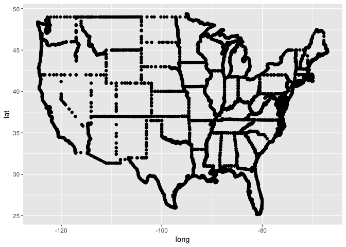<!-- -->

The `group` and `order` variables in the data set code relational information of the points. For example, there are 49 regions (all states minus Alaska and Hawaii, plus District of Columbia), 63 groups, and a varying number of points (observations) within each group. The observations denote the border points we plotted previously, and the order counter establishes the sequence in which they should be plotted.

```r
head(table(states_map$region))
```

```
## 
##     alabama     arizona    arkansas  california    colorado connecticut 
##         202         149         312         516          79          91
```

We can use `ggplot2`'s `geom_polygon()` function to plot the observations as polygons, rather than points. In order to do that, we need to specify the grouping parameter. If the data wasn't ordered correctly, we could use the `arrange()` function in the `dplyr` package to establish the correct sequencing of points for each polygon.

```r
ggplot(states_map, aes(x = long, y = lat, group = group)) +
  geom_polygon()
```

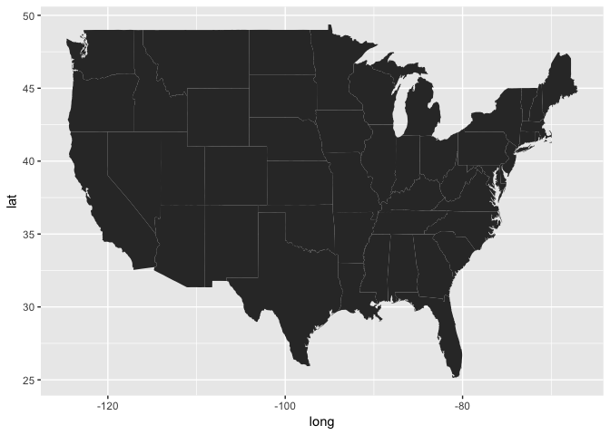<!-- -->

We are operating within the normal `ggplot2` environment, so all regular graphing parameters can be used with maps as well.

```r
ggplot(states_map, aes(x = long, y = lat, group = group)) +
  geom_polygon(fill = "darkcyan", color = "darkblue", alpha = 0.5) +
  theme_minimal()
```

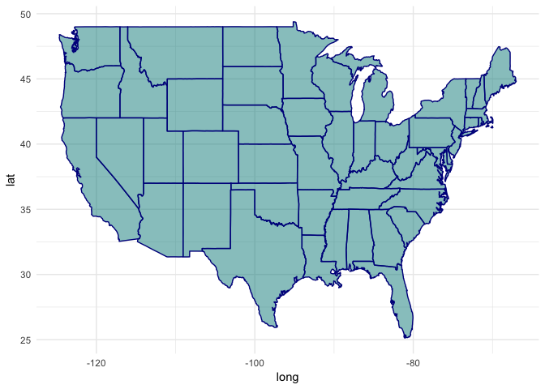<!-- -->

The map appears to be a bit "squished". This is because the scaling of the x-axis and y-axis is not based on the scaling of longitude and latitude. We can pass special mapping parameters to `ggplot2` via the   coord_map()` command to achieve the right aspect ratio or use different map projections.


```r
ggplot(states_map, aes(x = long, y = lat, group = group)) +
  geom_polygon(fill = "darkcyan", color = "darkblue", alpha = 0.5) +
  theme_minimal() +
  coord_map()
```

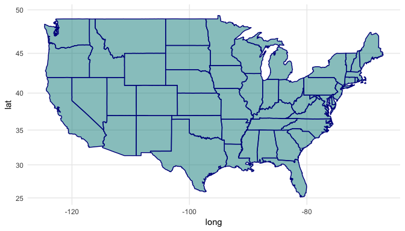<!-- -->


```r
ggplot(states_map, aes(x = long, y = lat, group = group)) +
  geom_polygon(fill = "darkcyan", color = "darkblue", alpha = 0.5) +
  theme_minimal() +
  coord_map("polyconic")
```

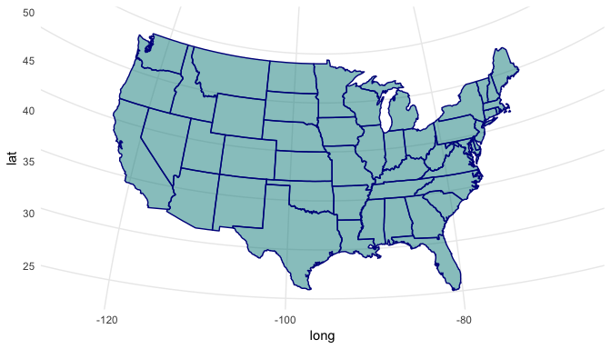<!-- -->

## Plotting points on a map
`ggplot2` allows for plotting in layers. We can use this feature to add points to our map of the continental US. For ease, we will use the data included in the `maps` package. The `us.cities` database contains information on US cities with a population greater than 40,000 and all state capitals. The database contains information on cities in Hawaii and Alaska as well. Before plotting, we will drop these observations before plotting them on our map of the continental US using the `dplyr` package.

```r
cities <- us.cities
table(cities$country.etc)
```

```
## 
##  AK  AL  AR  AZ  CA  CO  CT  DC  DE  FL  GA  HI  IA  ID  IL  IN  KS  KY 
##   2  11   9  21 208  21  21   1   2  76  15   2  10   7  42  19  11   6 
##  LA  ma  MA  MD  ME  MI  MN  MO  MS  MT  NC  ND  NE  NH  NJ  NM  NV  NY 
##  10   1  46  23   2  36  20  15   6   4  20   3   4   4  36   7  10  25 
##  OH  OK  OR  PA  RI  SC  SD  TN  TX  UT  VA  VT  WA  WI  WV  WY 
##  28  10  13  16   6   7   3  12  71  13  25   1  24  16   2   2
```

```r
#install.packages("dplyr")
library(dplyr)
cities_sub <- cities %>%
  filter(!(country.etc %in% c("AK", "HI")))
```

We plot the `cities_sub` data as an additional layer on top of the map of the continental US.

```r
ggplot() +
  geom_polygon(data = states_map, aes(x = long, y = lat, group = group),
               fill = "lightgrey", color = "black", size = 0.2, alpha = 0.2) +
  theme_minimal() +
  coord_map() +
  geom_point(data = cities_sub, aes(x = long, y = lat)) +
  labs(title = "US cities with over 40,000 inhabitants")
```

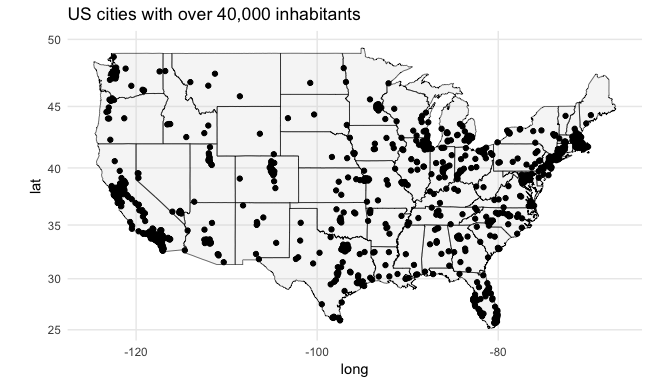<!-- -->

Again, we can use `ggplot2`'s regular graphing options in maps. In the following map we will use different colors for state capitals and denote the population of the cities through the size of the points. 

```r
ggplot() +
  geom_polygon(data = states_map, aes(x = long, y = lat, group = group),
               fill = "lightgrey", color = "black", size = 0.2, alpha = 0.2) +
  theme_minimal() +
  coord_map() +
  geom_point(data = cities_sub, aes(x = long, 
                                    y = lat, 
                                    color = factor(capital),
                                    size = pop),
             alpha = 0.6) +
  scale_color_manual(values = c("darkgrey", "red"), 
                     labels = c("City over 40,000", "State Capital"),
                     name = "Type") +
  scale_size_continuous(name = "Population") +
  theme(legend.position = "bottom") +
  labs(title = "US state capitals and cities with over 40,000 inhabitants")
```

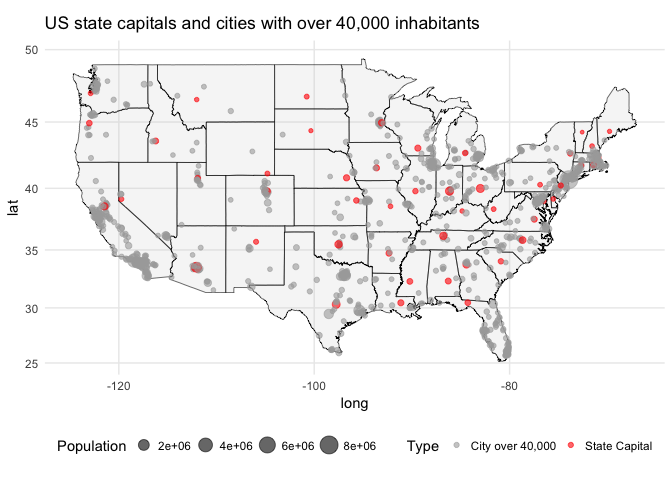<!-- -->

## Adding text
We can also use the names of the observations to label the state capitals.

```r
ggplot() +
  geom_polygon(data = states_map, aes(x = long, y = lat, group = group),
               fill = "lightgrey", color = "black", size = 0.2, alpha = 0.2) +
  theme_minimal() +
  coord_map() +
  geom_point(data = cities_sub, aes(x = long, 
                                    y = lat, 
                                    color = factor(capital),
                                    size = pop),
             alpha = 0.6) +
  scale_color_manual(values = c("darkgrey", "red"), 
                     labels = c("City over 40,000", "State Capital"),
                     name = "Type") +
  scale_size_continuous(name = "Population") +
  theme(legend.position = "bottom") +
  geom_text(data = subset(cities_sub, capital == 2),
            aes(x = long, y = lat, label = name),
            size = 3) +
  labs(title = "US state capitals and cities with over 40,000 inhabitants",
       x = "",
       y = "")
```

<!-- -->

## Subsetting maps
Since the spatial data is stored in a normal database, we can use subsetting to create maps of geographic units contained within a larger spatial database. For example, we could plot a map of California using the data from the `maps` package. We can either subset the data before plotting, or use the subset function when specifying the data frame within `ggplot2`.


```r
ggplot(subset(states_map, region == "california"), 
       aes(x = long, y = lat, group = group)) +
  geom_polygon() +
  coord_map()
```

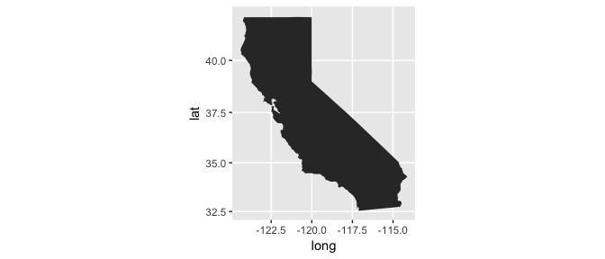<!-- -->


# Choropleth maps
Choropleth maps use differences in shading of specific geographic regions to visualize data. For example, one could use choropleth maps to denote the poverty level in all countries of the world, the average unemployment rate in US states, or the voter turnout in congressional districts. We could use the data from the `maps` package to create a choropleth map, but most often we will instead rely on so-called shape files for the geographic units we are studying.

One of the most commonly used sources of shape files is the Global Administrative Areas Database (GADM, http://www.gadm.org) that offers shape files for the administrative boundaries for most countries of the world free of charge. Which administrative boundaries are available varies by country. For example, for the United States, we have shape files at levels 0 (country), 1 (state), and 2 (country). For India, shape files are available for levels 0 (country), 1 (state), 2 (district), and 3 (taluk).


## Data on state-wise per capita net domestic product in Indian federal states
For our choropleth map we plot data on the per capita net state domestic product at current prices, available through https://data.gov.in/resources/capita-net-state-domestic-product-current-prices. For this tutorial, I downloaded, cleaned, and reshaped the data for the years 2006-2007 through 2010-2011.


```r
setwd("/Users/thereseanders/Documents/UNI/USC/Resources/R/Maps\ Workshop")
ind_dat <- read.csv("cleaned_india_pcndp.csv", stringsAsFactors = F) %>%
  select(id = state, everything()) #Renaming to match with map data
head(ind_dat)
```

```
##                  id  year      ndp
## 1    Andhra Pradesh y0607 33135.05
## 2 Arunachal Pradesh y0607 30000.24
## 3             Assam y0607 19737.00
## 4             Bihar y0607  9967.00
## 5         Jharkhand y0607 19789.00
## 6               Goa y0607 94881.58
```

## Shape file for Indian federal states
We read the shapefile into `R` using the `readShapePoly()` function from the `maptools` package. Note that there are other functions in other packages to achieve the same thing. The GADM download file (when downloaded in the shapefile format) contains a number of different files, that is .cpg, .csv (metadata), .dbf, .prj, .shp, and .shx. For the `readShapePoly()` function to work, we need at least the .shp, .shx, and .dbf files. Even though we only specify the .shp file within the `readShapePoly()` command, the function looks for .shx and .dbf with the same name within the same folder to read the shapefile object.

* .shp: Contains the information about the geometric shapes.
* .shx: Contains information about the positioning of the geometric shapes.
* .dbf: Contains metadata for the geometric shapes. For GADM, the .dbf file duplicates the information stored in the .csv file, but at the disadvantage that "non standard latin (roman / english) characters are lost in the shapefile" (see http://www.gadm.org/country). 

**Two notes on the method used here**: Please note that using the shapefile from GADM and downloading it prior to using it in `R` is the "hard" way of doing things. The GADM allows the download of spatial data in multiple formates, including `R SpatialPolygonsDataFrame`. However, to make this demonstration more generally applicable to shapefiles, which is a common format for spatial data, we will be working with the `shapefile` format (.shp, .shx, .dbf, .prj). In addition, the `raster` package allows us to access the GADM database directly. We could have accessed the maps directly from the `R` environment using the line of code below. Note, that this requires an internet connection and the data will be downloaded every time the code is run.

`India <- getData("GADM", country = "India", level = 1)`


```r
#install.packages("maptools")
library(maptools)
ind_poly <- readShapePoly("./IND_adm_shp/IND_adm1.shp") 
```

Sometimes, plotting maps is a very slow process, especially if many border points are used to plot polygons. Here, we therefor use the `gSimplify()` function from the `rgeos` package to reduce the information on the shape of the polygons and speed up plotting.

```r
#install.packages("rgeos")
library(rgeos)
ind_poly <- SpatialPolygonsDataFrame(gSimplify(ind_poly, 0.01), ind_poly@data)
```

First, let us investigate the structure of the `ind_poly` object. The `ind_poly` object contains a number of other data objects, such as the `data` object that stores metadata, as well as information on the polygons and plotting order. Here, we take a look at the metadata data frame object.

```r
test <- data.frame(ind_poly@data)
```

We can use the `fortify` function from the `ggplot2` package to bring the `polygons` part of the `ind_poly` object into the right format for plotting with `ggplot2`. We specify that the `NAME_1` variable from the `ind_poly` metadata file is to be used as the name of the regions, that is the name of the federal state.

```r
IndiaMap <- fortify(ind_poly, region = "NAME_1")
head(IndiaMap)
```

```
##       long      lat order  hole piece                  id
## 1 92.70087 12.23561     1 FALSE     1 Andaman and Nicobar
## 2 92.70371 12.16543     2 FALSE     1 Andaman and Nicobar
## 3 92.72115 12.18028     3 FALSE     1 Andaman and Nicobar
## 4 92.75682 12.17646     4 FALSE     1 Andaman and Nicobar
## 5 92.75825 12.18308     5 FALSE     1 Andaman and Nicobar
## 6 92.72344 12.18884     6 FALSE     1 Andaman and Nicobar
##                   group
## 1 Andaman and Nicobar.1
## 2 Andaman and Nicobar.1
## 3 Andaman and Nicobar.1
## 4 Andaman and Nicobar.1
## 5 Andaman and Nicobar.1
## 6 Andaman and Nicobar.1
```

## Merging shapefile and net domestic product data
Unfortunately, the state names between our net domestic product data and the GADM shapefile do not match in all cases. This is a common problem when working with maps and a lot of time is typically spent on cleaning and merging the data. For this workshop, I cleaned the data on the per capita net domestic product beforehand and matched the names in the shapefile and datafile.

We merge the geographic data contained in the `IndiaMap` file with the data on the per capita net domestic product of Indian federal states using the `full_join()` function from the `dplyr` package. Before merging, make sure that the names of the columns upon which you want to match the data are equal and that both columns are stored as character (string) values. Note that through the `full_join()` function, duplicates of each spatial data point in terms of both the state name and the year are created. This means we have to use either faceting or subsetting when mapping the data.


```r
# Make sure names and data storage type match before merging.
str(IndiaMap) # id is character
```

```
## 'data.frame':	16115 obs. of  7 variables:
##  $ long : num  92.7 92.7 92.7 92.8 92.8 ...
##  $ lat  : num  12.2 12.2 12.2 12.2 12.2 ...
##  $ order: int  1 2 3 4 5 6 7 8 9 10 ...
##  $ hole : logi  FALSE FALSE FALSE FALSE FALSE FALSE ...
##  $ piece: Factor w/ 68 levels "1","2","3","4",..: 1 1 1 1 1 1 1 1 1 1 ...
##  $ id   : chr  "Andaman and Nicobar" "Andaman and Nicobar" "Andaman and Nicobar" "Andaman and Nicobar" ...
##  $ group: Factor w/ 231 levels "Andaman and Nicobar.1",..: 1 1 1 1 1 1 1 1 1 1 ...
```

```r
str(ind_dat) # id is character
```

```
## 'data.frame':	160 obs. of  3 variables:
##  $ id  : chr  "Andhra Pradesh" "Arunachal Pradesh" "Assam" "Bihar" ...
##  $ year: chr  "y0607" "y0607" "y0607" "y0607" ...
##  $ ndp : num  33135 30000 19737 9967 19789 ...
```

```r
# Merging the data
ind_merged <- full_join(IndiaMap, ind_dat, by = "id")
head(ind_merged)
```

```
##       long      lat order  hole piece                  id
## 1 92.70087 12.23561     1 FALSE     1 Andaman and Nicobar
## 2 92.70087 12.23561     1 FALSE     1 Andaman and Nicobar
## 3 92.70087 12.23561     1 FALSE     1 Andaman and Nicobar
## 4 92.70087 12.23561     1 FALSE     1 Andaman and Nicobar
## 5 92.70087 12.23561     1 FALSE     1 Andaman and Nicobar
## 6 92.70371 12.16543     2 FALSE     1 Andaman and Nicobar
##                   group  year   ndp
## 1 Andaman and Nicobar.1 y0607 53778
## 2 Andaman and Nicobar.1 y0708 61430
## 3 Andaman and Nicobar.1 y0809 69177
## 4 Andaman and Nicobar.1 y0910 79396
## 5 Andaman and Nicobar.1 y1011 85741
## 6 Andaman and Nicobar.1 y0607 53778
```

## Plotting the choropleth map for the year 2010-2011
Recall that for the `ggplot()` function to correctly plot the polygons, the correct order of the border points of each polygon needs to be specified. While most shapefiles will come in the correct order, the sequencing can be impaired through merging and other data management operations. Therefore, we first (re)establish the correct ordering of the observations.


```r
# Reordering the data
ind_merged <- arrange(ind_merged, group, order)
```

Recall that we matched five years of NDP data to each federal state in the shapefile. We therefore need to subset the data to plot the correct values for the fiscal year 2010-2011.

```r
ggplot(subset(ind_merged, year == "y1011"), 
       aes(x = long, y = lat, group = group, fill = ndp)) +
  geom_polygon() +
  coord_map() +
  theme_minimal() +
  labs(title = "Per Capita Net Domestic Product in 2010-2011")
```

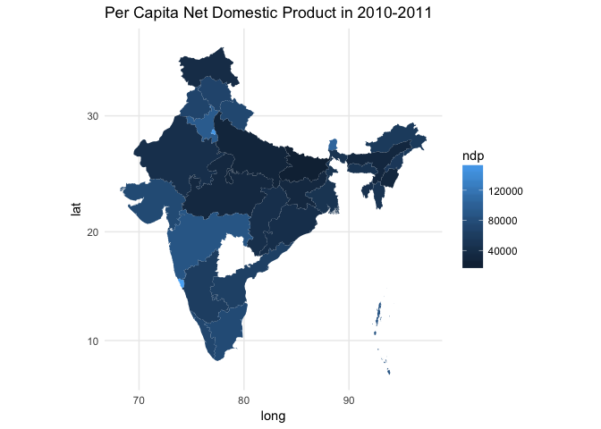<!-- -->

Alternatively, we can use faceting to plot the evolution of the NDP over all years in our dataset. Because we have some missing value, we first subset the data. We could recode factor levels to create better labels for our facets.

```r
ggplot(subset(ind_merged, !is.na(year)), 
       aes(x = long, y = lat, group = group, fill = ndp)) +
  geom_polygon() +
  coord_map() +
  theme_minimal() +
  labs(title = "Per Capita Net Domestic Product",
       x = "",
       y = "") +
  facet_wrap(~ year, nrow = 1) +
  scale_fill_continuous(name = "Per capita net\ndomestic product")
```

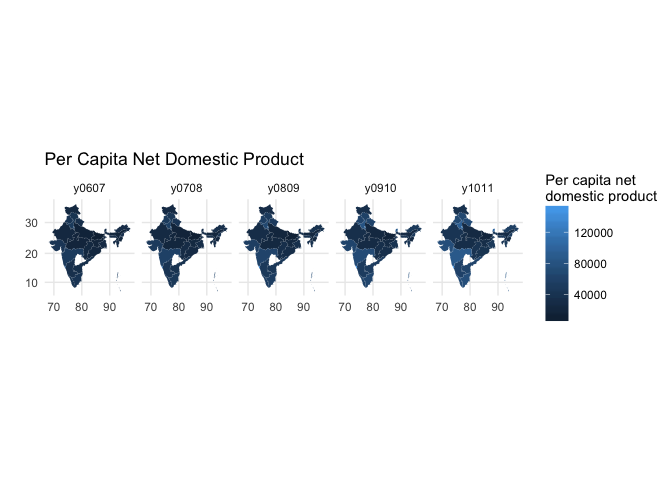<!-- -->


## Improving the map
### Missing data
The map of India above contains a missing polygon: The Indian federal state of Telangana, that was created in 2014 and therefore does not have an observation of NDP for 2010-2011. Because we are subsetting by the `year` variable, the geometric data for the Telangana polygon drops out of the data set. One solution would be to manually code years for Telangana but keep the `ndp` variable coded as missing. This would plot the state of Telangana on the map, but denote the NDP value as missing (by default, `ggplot2` shades missing polygons in grey).

### Changing the colors
The default color scheme is not very intuitive and does a mediocre job at visualizing the differences between high- and low income states. We can change the colors using the `scale_fill_continuous()` parameter in `ggplot()`.

```r
ggplot(subset(ind_merged, year == "y1011"), 
       aes(x = long, y = lat, group = group, fill = ndp)) +
  geom_polygon() +
  coord_map() +
  theme_minimal() +
  labs(title = "Per Capita Net Domestic Product in 2010-2011") +
  scale_fill_gradient(low = "yellow", high = "red")
```

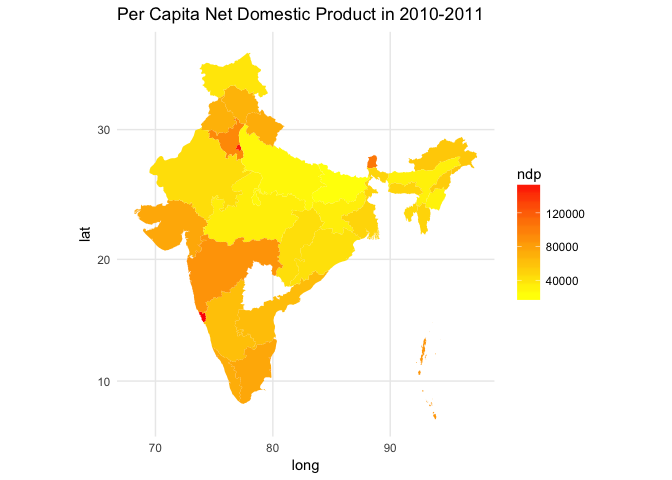<!-- -->

### Changing the scale
So far, we have shaded the polygons based on a linear scale of the NDP value. This might not be appropriate for this application for two reasons. In terms of visualization, income is typically not normally distributed, and indeed the NDP of Goa and Delhi in 2010-2011 appear to be outliers. Due to these outliers, the differences in the NDP of the other states are compressed, and therefore much harder to see in the choropleth map. 

```r
ggplot(subset(ind_dat, year == "y1011"), aes(x = ndp)) +
  geom_line(stat = "density")
```

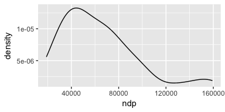<!-- -->

In substantive terms, when judging the welfare of people, we might think that an additional income 1000 rupees (approximately 15USD) for someone who is earning 10,000 rupees represents a larger increase in welfare than for someone who is earning 100,000 rupees. We can express this interpretation of welfare status and reduce the influence of outliers by expressing NDP on a logarithmic, rather than a linear, scale. In `ggplot2` we can implement this by adding the `trans = "log"` parameter to the ` scale_fill_gradient()` function.

```r
ggplot(subset(ind_merged, year == "y1011"), aes(x = long, y = lat, group = group, fill = ndp)) +
  geom_polygon() +
  coord_map() +
  theme_minimal() +
  labs(title = "Per Capita Net Domestic Product in 2010-2011") +
  scale_fill_gradient(trans = "log", low = "yellow", high = "red")
```

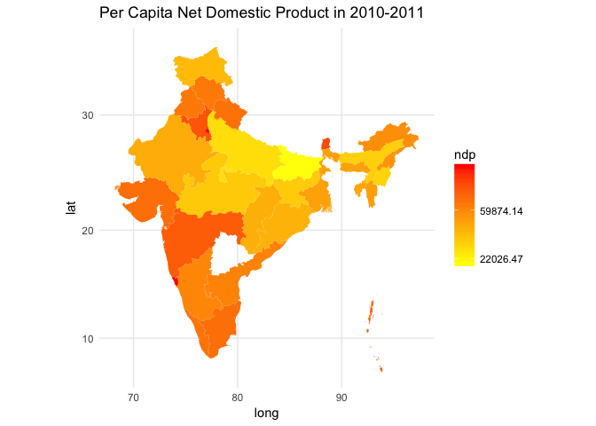<!-- -->

# Using Google Maps in `R`
An alternative to shape files is the use of online map data as the basis for the visualization of spatial data. The `ggmap` package allows us to directly query Google Maps, OpenStreetMap, Stamen Maps, or Naver Map servers for a map. Here, we use the `qmap()` function from the `ggmap` package to retrieve a map of Los Angeles county. The default is to query Google Maps for the location. `qmap()` has a number parameters that allow us to adjust the type and aesthetics of the output map.

```r
#install.packages("ggmap", type = "source")
library(ggmap)
qmap(location = "LA county")
```

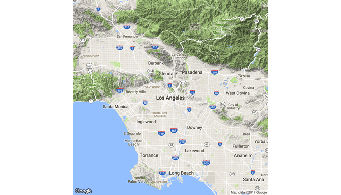<!-- -->

```r
qmap(location = "LA county", maptype = "satellite")
```

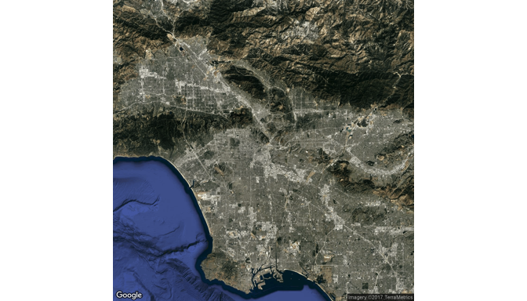<!-- -->

```r
# Saving a black and white map
lamap <- qmap(location = "Los Angeles county", color = "bw")
```

## Assessing Los Angeles Air Quality
We can plot additional information on the maps we retrieved from Google Maps. As an example, let us consider air quality measurements. As of Spring 2017, the United States Environmental Protection Agency (EPA) still publishes fine-grained geo-locaded data on their air quality measurement stations. Here we use a data file that contains 24-hour average fine particular matter (PM2.5) readings for all US measurement stations in 2016 (source: https://aqsdr1.epa.gov/aqsweb/aqstmp/airdata/daily_88101_2016.zip).

We subset this data to contain only measurements from Los Angeles county and compute the median fine particular matter air quality index for each LA county site in 2016.

```r
dat <- read.csv("daily_88101_2016.csv") 
aqi <- dat %>%
  dplyr::filter(County.Name == "Los Angeles") %>%
  dplyr::group_by(Longitude, Latitude, Local.Site.Name) %>%
  dplyr::summarise(median_aqi = median(AQI))
```

We then plot the air quality data onto the map of Los Angeles we retrieved from Google Maps above, letting the color of the points represent the median air quality index for each station.

```r
lamap +
  geom_point(data = aqi, aes(x = Longitude, y = Latitude, color = median_aqi), size = 8, alpha = 0.5) +
  scale_color_gradient(low = "green", high = "red", 
                       name = "Median PM2.5") +
  labs(title = "LA County Air Quality Index for Fine Particular Matter in 2016")
```

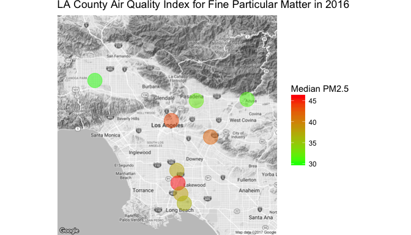<!-- -->

## Density Map
According to the EPA, fine particular matter PM2.5 should not exceed 35 microcrams per cubic meter of air in a 24-hour average (https://www.epa.gov/criteria-air-pollutants/naaqs-table). Rather than looking at the annual median value of the air quality standard to assess the level of air pollution, we could measure the number of times a station reading exceeds this standard. 

To do this for the state of California, we first use the `qmap` function from the `ggmaps` package to retrieve a map of California from Google Maps. Depending on your application, you might have to manually adjust the `zoom` parameter to get the appropriate map.

```r
camap <- qmap(location = "California", zoom = 6, color = "bw")
```

We then subset the 2016 EPA data to include only observations from California and only cases where the 24-hour average PM2.5 reading exceeded the 35 microcrams per cubic meter of air standard.

```r
pm25 <- dat %>%
  dplyr::filter(State.Name == "California",
                Arithmetic.Mean >= 35)
```

Finally, we plot the density of observations that exceed the daily air quality standard on the map using `ggplot2`'s `stat_density2d()` function. Note that we are not mapping a specific variable, but rather plot the frequency and clustering of observations in our `pm25` subset of all station readings in 2016. This is achieved through the `..level..` argument that is passed to the `fill` parameter inside the `stat_density2d()` function.

```r
camap + stat_density2d(data = pm25, 
                       aes(x = Longitude, y = Latitude, 
                           fill = ..level..), #mapping observations not any specific variable
                       alpha = 0.5,
                       geom = "polygon") +
  scale_fill_gradient(low = "black", high = "red", 
                       name = "Density of daily\nair quality exceeding\nPM2.5 Standard") +
  labs(title = "Fine Particular Matter Pollution in California in 2016")
```

<!-- -->

